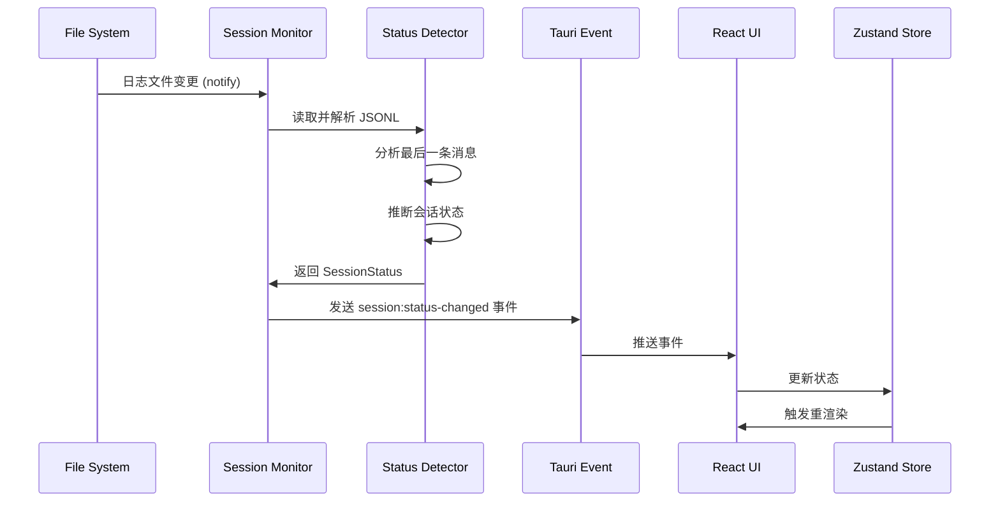
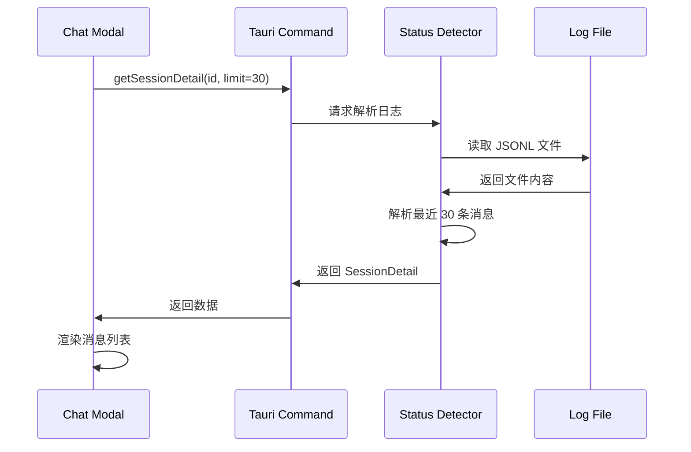
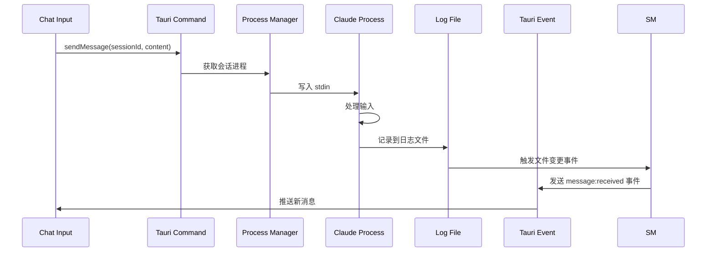

# CodeAgent Dashboard 技术设计文档

## 文档信息

| 项目 | 内容 |
|------|------|
| 版本 | v2.0 |
| 日期 | 2026-01-29 |
| 状态 | 已更新（根据架构评审意见） |

---

## 1. 概述

### 1.1 设计目标

本文档定义 CodeAgent Dashboard 的系统架构、技术选型和模块设计，作为开发实施的依据。

### 1.2 核心设计决策

| 决策项 | 选择 | 关键理由 |
|--------|------|----------|
| GUI 框架 | Tauri 2.0 | 包体积小 90%，内存低 50%，启动快 3-5 倍 |
| 后端语言 | Rust | Tauri 原生支持，系统级性能，内存安全 |
| 前端框架 | React + TypeScript | 生态成熟，类型安全，Tauri 官方支持 |
| 样式方案 | TailwindCSS | 原子化 CSS，开发效率高 |
| 状态管理 | Zustand | 轻量级，无需样板代码 |
| 状态检测 | 日志监控 + 锁文件 | 非侵入式，信息丰富，实时性好 |

---

## 2. 系统架构

### 2.1 分层架构

采用**分层架构 + 事件驱动**的混合模式：

```
┌─────────────────────────────────────────────────────────────┐
│                    Presentation Layer                       │
│  ┌─────────────┐  ┌─────────────┐  ┌─────────────────────┐  │
│  │ Dashboard   │  │ Session     │  │ Chat Modal          │  │
│  │ UI          │  │ Card        │  │ (xterm.js)          │  │
│  └─────────────┘  └─────────────┘  └─────────────────────┘  │
│  ┌─────────────────────────────────────────────────────────┐│
│  │              Zustand State Store                        ││
│  └─────────────────────────────────────────────────────────┘│
├─────────────────────────────────────────────────────────────┤
│                    Bridge Layer                             │
│  ┌─────────────────┐  ┌─────────────────────────────────┐   │
│  │ Tauri Commands  │  │ Tauri Events (WebSocket-like)   │   │
│  │ (Request/Response)│  │ (Push Notifications)            │   │
│  └─────────────────┘  └─────────────────────────────────┘   │
├─────────────────────────────────────────────────────────────┤
│                    Core Layer (Rust)                        │
│  ┌─────────────┐  ┌─────────────┐  ┌─────────────────────┐  │
│  │ Session     │  │ Status      │  │ Process Manager     │  │
│  │ Monitor     │  │ Detector    │  │                     │  │
│  └─────────────┘  └─────────────┘  └─────────────────────┘  │
│  ┌─────────────┐  ┌─────────────────────────────────────────┐│
│  │ File        │  │ Agent Adapter (Trait)                   ││
│  │ Storage     │  │                                         ││
│  └─────────────┘  └─────────────────────────────────────────┘│
├─────────────────────────────────────────────────────────────┤
│                    Data Layer                               │
│  ┌─────────────────┐  ┌─────────────┐  ┌─────────────────┐  │
│  │ ~/.codeagent/   │  │ ~/.claude/  │  │ ~/.claude/ide/  │  │
│  │ (App Data)      │  │ projects/   │  │ (Lock Files)    │  │
│  │                 │  │ (Logs)      │  │                 │  │
│  └─────────────────┘  └─────────────┘  └─────────────────┘  │
└─────────────────────────────────────────────────────────────┘
```

### 2.2 各层职责

| 层级 | 职责 | 关键技术 |
|------|------|----------|
| Presentation | UI 渲染、用户交互、状态管理 | React, TailwindCSS, Zustand |
| Bridge | 前后端通信、类型安全绑定 | Tauri Commands/Events |
| Core | 业务逻辑、文件监控、进程管理 | Rust, tokio, notify |
| Data | 本地数据持久化、外部数据读取 | JSON, File System |

---

## 3. 模块设计

### 3.1 模块一览

| 模块名 | 职责 | 所在层级 |
|--------|------|----------|
| Dashboard UI | 仪表盘界面、统计栏、会话列表 | Frontend |
| Session Card | 会话卡片组件、状态徽章、快捷操作 | Frontend |
| Chat Modal | 对话弹窗、消息历史、输入框 | Frontend |
| Session Store | 全局状态管理、缓存策略 | Frontend |
| Session Monitor | 监控日志文件变化、扫描活跃会话 | Backend |
| Status Detector | 解析 JSONL、推断会话状态 | Backend |
| Process Manager | 包装器模式、进程 I/O 代理 | Backend |
| File Storage | 本地 JSON 数据持久化 | Backend |
| Agent Adapter | 多 Agent 适配接口 | Backend |

### 3.2 核心模块详细设计

#### Session Monitor（会话监控器）

```rust
/// 会话监控器，负责发现和监控 Claude Code 会话
pub struct SessionMonitor {
    watcher: RecommendedWatcher,
    sessions: Arc<RwLock<HashMap<String, SessionInfo>>>,
    event_sender: mpsc::Sender<MonitorEvent>,
}

impl SessionMonitor {
    /// 扫描所有活跃会话
    pub async fn scan_sessions(&self) -> Result<Vec<SessionInfo>, Error>;

    /// 开始监控指定项目的日志文件
    pub async fn watch_project(&mut self, project_path: &Path) -> Result<(), Error>;

    /// 停止监控指定项目
    pub async fn unwatch_project(&mut self, project_path: &Path) -> Result<(), Error>;

    /// 获取监控事件流
    pub fn event_stream(&self) -> mpsc::Receiver<MonitorEvent>;
}

/// 监控事件
pub enum MonitorEvent {
    /// 发现新会话
    SessionDiscovered(SessionInfo),
    /// 会话状态变更
    StatusChanged(String, SessionStatus),
    /// 新消息
    NewMessage(String, Message),
    /// 文件变更
    LogFileChanged(PathBuf),
}
```

#### Status Detector（状态检测器）

```rust
/// 状态检测器，解析日志文件推断会话状态
pub struct StatusDetector;

impl StatusDetector {
    /// 从日志文件检测当前状态
    pub fn detect(log_path: &Path) -> Result<SessionStatus, Error> {
        let last_event = Self::read_last_event(log_path)?;
        Self::infer_from_event(&last_event)
    }

    /// 分析最后一条事件推断状态
    fn infer_from_event(event: &LogEvent) -> Result<SessionStatus, Error> {
        match event.event_type.as_str() {
            "assistant" => {
                // 检查 assistant 消息是否包含问题或等待确认
                if Self::is_asking_question(&event.message) {
                    Ok(SessionStatus::WaitingInput)
                } else {
                    Ok(SessionStatus::Running)
                }
            }
            "user" => Ok(SessionStatus::Running), // 用户刚输入，正在处理
            "queue-operation" => Ok(SessionStatus::Running),
            "file-history-snapshot" => Ok(SessionStatus::Running),
            _ => Ok(SessionStatus::Unknown),
        }
    }

    /// 提取最近 N 条消息摘要
    pub fn extract_messages(log_path: &Path, limit: usize) -> Result<Vec<Message>, Error>;
}

/// 四种会话状态
#[derive(Debug, Clone, Serialize, Deserialize)]
#[serde(rename_all = "snake_case")]
pub enum SessionStatus {
    Running,       // 运行中 - 脉冲绿点
    WaitingInput,  // 等待输入 - 黄色点
    Completed,     // 已完成 - 蓝色点
    Blocked,       // 执行阻塞 - 红色脉冲
    Unknown,       // 未知状态
}
```

#### Process Manager（进程管理器）

```rust
/// 进程管理器，负责启动包装器和 I/O 代理
pub struct ProcessManager {
    active_sessions: Arc<RwLock<HashMap<String, ManagedProcess>>>,
}

impl ProcessManager {
    /// 启动包装器会话（用户通过 `cc` 命令间接调用）
    pub async fn spawn_wrapped_session(
        &self,
        project_path: &Path,
        title: Option<String>,
    ) -> Result<SessionInfo, Error>;

    /// 将 GUI 连接到已存在的包装器会话
    pub async fn attach_to_session(
        &self,
        session_id: &str,
    ) -> Result<SessionHandle, Error>;

    /// 向会话发送输入
    pub async fn send_input(&self, session_id: &str, input: &str) -> Result<(), Error>;

    /// 打开系统终端
    pub async fn open_terminal(&self, project_path: &Path) -> Result<(), Error>;

    /// 标记会话完成
    pub async fn mark_completed(&self, session_id: &str) -> Result<(), Error>;
}

/// 被管理的进程
struct ManagedProcess {
    pid: u32,
    stdin: ChildStdin,
    stdout: ChildStdout,
    stderr: ChildStderr,
    project_path: PathBuf,
}
```

#### Agent Adapter（Agent 适配器）

```rust
/// Agent 适配器 Trait，用于支持多种 Code Agent
#[async_trait]
pub trait AgentAdapter: Send + Sync {
    /// Agent 类型标识
    fn agent_type(&self) -> &'static str;

    /// 检测该 Agent 的活跃会话
    async fn detect_sessions(&self) -> Result<Vec<SessionInfo>, Error>;

    /// 获取日志文件路径
    fn log_paths(&self, project_path: &Path) -> Vec<PathBuf>;

    /// 解析日志文件获取状态
    async fn parse_status(&self, log_path: &Path) -> Result<SessionStatus, Error>;

    /// 获取命令行启动命令
    fn launch_command(&self, project_path: &Path) -> Command;
}

/// Claude Code 适配器
pub struct ClaudeAdapter;

#[async_trait]
impl AgentAdapter for ClaudeAdapter {
    fn agent_type(&self) -> &'static str {
        "claude"
    }

    async fn detect_sessions(&self) -> Result<Vec<SessionInfo>, Error> {
        // 扫描 ~/.claude/projects/ 和 ~/.claude/ide/*.lock
    }

    // ... 其他实现
}
```

### 3.3 存储层设计（Repository Pattern）

为提高存储层的可测试性和可扩展性，引入 Repository Pattern 抽象数据访问。

#### 架构设计

```
┌─────────────────────────────────────────────────────────────┐
│                    Repository Layer                         │
│  ┌─────────────────┐  ┌─────────────────┐  ┌─────────────┐ │
│  │ SessionRepo     │  │ MessageRepo     │  │ ProjectRepo │ │
│  │ (会话存储)       │  │ (消息存储)       │  │ (项目存储)   │ │
│  │ Trait           │  │ Trait           │  │ Trait       │ │
│  └─────────────────┘  └─────────────────┘  └─────────────┘ │
├─────────────────────────────────────────────────────────────┤
│                    Implementation Layer                     │
│  ┌─────────────────┐  ┌─────────────────┐  ┌─────────────┐ │
│  │ FileSessionRepo │  │ CachedSession   │  │ MemoryRepo  │ │
│  │ (文件实现)       │  │ Repo            │  │ (测试)      │ │
│  │                 │  │ (缓存装饰器)     │  │             │ │
│  └─────────────────┘  └─────────────────┘  └─────────────┘ │
└─────────────────────────────────────────────────────────────┘
```

#### Repository Trait 定义

```rust
/// 会话存储接口
#[async_trait]
pub trait SessionRepository: Send + Sync {
    /// 获取会话
    async fn get(&self, id: &str) -> Result<Option<Session>>;

    /// 保存会话
    async fn save(&self, session: &Session) -> Result<()>;

    /// 删除会话
    async fn delete(&self, id: &str) -> Result<()>;

    /// 列出所有会话
    async fn list(&self, filter: SessionFilter) -> Result<Vec<Session>>;

    /// 更新会话状态
    async fn update_status(
        &self,
        id: &str,
        status: SessionStatus,
    ) -> Result<()>;

    /// 根据项目路径查找会话
    async fn find_by_project(
        &self,
        project_path: &Path,
    ) -> Result<Vec<Session>>;
}

/// 消息存储接口
#[async_trait]
pub trait MessageRepository: Send + Sync {
    /// 获取消息
    async fn get(
        &self,
        session_id: &str,
        message_id: &str,
    ) -> Result<Option<Message>>;

    /// 保存消息
    async fn save(&self, session_id: &str, message: &Message) -> Result<()>;

    /// 批量保存消息
    async fn save_batch(
        &self,
        session_id: &str,
        messages: &[Message],
    ) -> Result<()>;

    /// 列出消息（支持分页）
    async fn list(
        &self,
        session_id: &str,
        pagination: Pagination,
    ) -> Result<PaginatedResult<Message>>;

    /// 获取最新消息
    async fn get_latest(
        &self,
        session_id: &str,
        limit: usize,
    ) -> Result<Vec<Message>>;
}

/// 项目存储接口
#[async_trait]
pub trait ProjectRepository: Send + Sync {
    /// 获取项目
    async fn get(&self, path: &Path) -> Result<Option<Project>>;

    /// 保存项目
    async fn save(&self, project: &Project) -> Result<()>;

    /// 删除项目
    async fn delete(&self, path: &Path) -> Result<()>;

    /// 列出所有项目
    async fn list(&self) -> Result<Vec<Project>>;

    /// 更新最后访问时间
    async fn update_access_time(&self, path: &Path) -> Result<()>;
}
```

#### 具体实现

```rust
/// 文件系统会话存储实现
pub struct FileSessionRepository {
    data_dir: PathBuf,
}

#[async_trait]
impl SessionRepository for FileSessionRepository {
    async fn get(&self, id: &str) -> Result<Option<Session>> {
        let path = self.session_path(id);

        if !path.exists() {
            return Ok(None);
        }

        let content = fs::read_to_string(&path).await?;
        let session: Session = serde_json::from_str(&content)?;

        Ok(Some(session))
    }

    async fn save(&self, session: &Session) -> Result<()> {
        let path = self.session_path(&session.id);

        // 确保目录存在
        if let Some(parent) = path.parent() {
            fs::create_dir_all(parent).await?;
        }

        // 写入临时文件，然后原子重命名
        let temp_path = path.with_extension("tmp");
        fs::write(&temp_path, serde_json::to_string_pretty(session)?).await?;
        fs::rename(&temp_path, &path).await?;

        Ok(())
    }

    async fn list(&self, filter: SessionFilter) -> Result<Vec<Session>> {
        let mut sessions = Vec::new();

        let mut entries = fs::read_dir(&self.data_dir).await?;
        while let Some(entry) = entries.next_entry().await? {
            let path = entry.path();

            if path.extension() != Some("json".as_ref()) {
                continue;
            }

            let content = fs::read_to_string(&path).await?;
            let session: Session = serde_json::from_str(&content)?;

            // 应用过滤器
            if filter.matches(&session) {
                sessions.push(session);
            }
        }

        // 排序
        sessions.sort_by(|a, b| b.last_active_at.cmp(&a.last_active_at));

        Ok(sessions)
    }

    // ... 其他实现
}
```

#### 缓存装饰器

```rust
/// 带缓存的 Repository 装饰器
pub struct CachedSessionRepository<R: SessionRepository> {
    inner: R,
    cache: Arc<RwLock<LruCache<String, Session>>>,
    ttl: Duration,
}

impl<R: SessionRepository> CachedSessionRepository<R> {
    pub fn new(inner: R, cache_size: usize, ttl: Duration) -> Self {
        Self {
            inner,
            cache: Arc::new(RwLock::new(LruCache::new(cache_size))),
            ttl,
        }
    }

    /// 使缓存失效
    pub fn invalidate(&self, id: &str) {
        self.cache.write().pop(id);
    }
}

#[async_trait]
impl<R: SessionRepository> SessionRepository for CachedSessionRepository<R> {
    async fn get(&self, id: &str) -> Result<Option<Session>> {
        // 尝试从缓存获取
        {
            let cache = self.cache.read();
            if let Some(session) = cache.peek(id) {
                return Ok(Some(session.clone()));
            }
        }

        // 缓存未命中，从底层存储获取
        let session = self.inner.get(id).await?;

        // 写入缓存
        if let Some(ref s) = session {
            self.cache.write().put(id.to_string(), s.clone());
        }

        Ok(session)
    }

    async fn save(&self, session: &Session) -> Result<()> {
        // 先写入底层存储
        self.inner.save(session).await?;

        // 更新缓存
        self.cache.write().put(session.id.clone(), session.clone());

        Ok(())
    }

    // 列表操作通常不走缓存
    async fn list(&self, filter: SessionFilter) -> Result<Vec<Session>> {
        self.inner.list(filter).await
    }

    // ... 其他实现
}
```

#### Repository 工厂

```rust
/// Repository 工厂
pub struct RepositoryFactory;

impl RepositoryFactory {
    /// 创建默认的 SessionRepository（带缓存）
    pub fn create_session_repository(
        data_dir: &Path,
    ) -> impl SessionRepository {
        let file_repo = FileSessionRepository::new(data_dir.join("sessions"));

        CachedSessionRepository::new(
            file_repo,
            1000,                     // 缓存 1000 个会话
            Duration::from_secs(300), // 5 分钟 TTL
        )
    }

    /// 创建测试用的内存 Repository
    pub fn create_memory_session_repository() -> impl SessionRepository {
        MemorySessionRepository::new()
    }
}
```

---

## 4. 数据模型

### 4.1 核心数据结构

#### Session（会话）

```typescript
interface Session {
  /** 会话唯一标识 (UUID) */
  id: string;

  /** 会话标题 */
  title: string;

  /** 项目名称（目录名） */
  projectName: string;

  /** 项目绝对路径 */
  projectPath: string;

  /** Agent 类型 */
  agentType: 'claude' | string;

  /** 当前状态 */
  status: SessionStatus;

  /** 会话创建时间 (ISO 8601) */
  createdAt: string;

  /** 最后活跃时间 (ISO 8601) */
  lastActiveAt: string;

  /** 最近消息摘要 */
  summary?: string;

  /** 是否已归档 */
  isArchived: boolean;
}

type SessionStatus =
  | 'running'        // 运行中 - 脉冲绿点
  | 'waiting_input'  // 等待输入 - 黄色点
  | 'completed'      // 已完成 - 蓝色点
  | 'blocked';       // 执行阻塞 - 红色脉冲
```

#### SessionDetail（会话详情）

```typescript
interface SessionDetail extends Session {
  /** 完整对话历史（默认最近 30 条） */
  messages: Message[];

  /** 进程信息 */
  processInfo?: ProcessInfo;

  /** 会话统计 */
  stats: SessionStats;
}

interface Message {
  /** 消息 ID */
  id: string;

  /** 发送者角色 */
  role: 'user' | 'assistant';

  /** 消息内容 */
  content: string;

  /** 发送时间 (ISO 8601) */
  timestamp: string;

  /** 附加元数据 */
  metadata?: {
    /** 是否包含代码块 */
    hasCode: boolean;
    /** Token 使用量（如可获得） */
    tokenCount?: number;
  };
}

interface ProcessInfo {
  /** 进程 ID */
  pid: number;

  /** 启动时间 */
  startTime: string;

  /** 完整命令行 */
  commandLine: string;
}

interface SessionStats {
  /** 消息总数 */
  messageCount: number;

  /** 总 Token 使用量 */
  totalTokens?: number;

  /** 会话持续时间（秒） */
  duration: number;
}
```

#### Project（项目）

```typescript
interface Project {
  /** 项目路径（唯一标识） */
  path: string;

  /** 项目名称 */
  name: string;

  /** 最后访问时间 */
  lastAccessedAt: string;

  /** 关联会话数量 */
  sessionCount: number;

  /** 项目配置 */
  config?: ProjectConfig;
}

interface ProjectConfig {
  /** 是否自动启动 */
  autoStart: boolean;

  /** 默认 Agent 类型 */
  defaultAgent: string;

  /** 环境变量 */
  envVars: Record<string, string>;
}
```

### 4.2 存储结构设计

```
~/.codeagent/                          # 应用数据目录
├── config.json                        # 全局配置
├── sessions/
│   ├── index.json                     # 会话索引（快速加载）
│   └── {session_id}.json              # 单个会话详情
├── projects.json                      # 项目列表
└── cache/
    └── status_snapshot.json           # 状态快照（快速恢复）
```

#### config.json

```json
{
  "version": "1.0.0",
  "settings": {
    "autoRefreshInterval": 5000,
    "maxSessionHistory": 100,
    "notificationEnabled": true,
    "messageLoadLimit": 30
  },
  "ui": {
    "theme": "dark",
    "sidebarCollapsed": false
  }
}
```

---

## 5. 安全与隐私设计

### 5.1 安全架构

Dashboard 处理用户代码和对话内容，需建立多层安全防护：

```
┌─────────────────────────────────────────────────────────────┐
│                    Security Layer                           │
│  ┌─────────────┐  ┌─────────────┐  ┌─────────────────────┐  │
│  │ Data Masking│  │ Config      │  │ Process             │  │
│  │ (数据脱敏)   │  │ Encryption  │  │ Verification       │  │
│  └─────────────┘  └─────────────┘  └─────────────────────┘  │
├─────────────────────────────────────────────────────────────┤
│                    Access Control                           │
│  ┌─────────────┐  ┌─────────────┐  ┌─────────────────────┐  │
│  │ Session     │  │ File Access │  │ API                 │  │
│  │ Isolation   │  │ Permissions │  │ Rate Limiting      │  │
│  └─────────────┘  └─────────────┘  └─────────────────────┘  │
└─────────────────────────────────────────────────────────────┘
```

### 5.2 数据脱敏与隐私保护

#### 敏感信息识别规则

| 类型 | 识别模式 | 脱敏策略 |
|------|----------|----------|
| API Key / Token | `[A-Za-z0-9_]{32,}` | 显示前 4 位 + `****` |
| 密码/密钥 | `(password｜secret｜key)=\S+` | 完全替换为 `[REDACTED]` |
| 文件路径 | `/Users/[^/]+/` | 替换为 `~/` |
| 邮箱地址 | `[\w.-]+@[\w.-]+` | 显示域名，用户名脱敏 |
| IP 地址 | `\d{1,3}\.\d{1,3}\.\d{1,3}\.\d{1,3}` | 末段替换为 `xxx` |

#### 脱敏实现

```rust
/// 敏感信息脱敏器
pub struct DataMasker;

impl DataMasker {
    /// 对消息内容进行脱敏处理
    pub fn mask_message(content: &str) -> String {
        let mut result = content.to_string();
        result = Self::mask_api_keys(&result);
        result = Self::mask_secrets(&result);
        result = Self::mask_paths(&result);
        result
    }

    /// 检测内容是否包含敏感信息
    pub fn contains_sensitive(content: &str) -> bool {
        // 使用正则匹配敏感模式
        Self::SENSITIVE_PATTERN.is_match(content)
    }
}
```

### 5.3 配置安全存储

#### 敏感配置加密

```rust
/// 安全配置存储
pub struct SecureConfigStore {
    /// 使用系统密钥链存储加密密钥
    keychain: Keychain,
}

impl SecureConfigStore {
    /// 保存敏感配置项
    pub async fn save_secret(&self, key: &str, value: &str) -> Result<()> {
        // 1. 使用 AES-256-GCM 加密
        let encrypted = self.encrypt(value)?;
        // 2. 存储到系统密钥链或加密文件
        self.keychain.set_password(key, &encrypted).await?;
        Ok(())
    }

    /// 读取敏感配置项
    pub async fn get_secret(&self, key: &str) -> Result<Option<String>> {
        let encrypted = self.keychain.get_password(key).await?;
        encrypted.map(|e| self.decrypt(&e)).transpose()
    }
}
```

#### 需加密的配置项

| 配置项 | 存储方式 | 说明 |
|--------|----------|------|
| `authToken` | 系统密钥链 | Claude Code 认证令牌 |
| `apiKeys` | 加密文件 | 用户配置的 API 密钥 |
| `proxy.password` | 系统密钥链 | 代理服务器密码 |

### 5.4 进程通信安全

#### 包装器模式安全验证

```rust
/// 进程通信验证器
pub struct ProcessValidator {
    /// 会话令牌映射
    session_tokens: Arc<RwLock<HashMap<String, Uuid>>>,
}

impl ProcessValidator {
    /// 建立安全连接时生成令牌
    pub fn generate_token(&self, session_id: &str) -> Uuid {
        let token = Uuid::new_v4();
        self.session_tokens.write().insert(session_id.to_string(), token);
        token
    }

    /// 验证连接请求
    pub fn verify_connection(&self, session_id: &str, token: Uuid) -> bool {
        self.session_tokens.read()
            .get(session_id)
            .map(|t| *t == token)
            .unwrap_or(false)
    }
}
```

#### 输入验证与过滤

```rust
/// 输入验证器
pub struct InputValidator;

impl InputValidator {
    /// 验证用户输入
    pub fn validate_input(input: &str) -> Result<(), ValidationError> {
        // 1. 长度限制（单条消息最大 100KB）
        if input.len() > 100 * 1024 {
            return Err(ValidationError::TooLong);
        }

        // 2. 危险字符检测
        if Self::contains_dangerous_chars(input) {
            return Err(ValidationError::InvalidCharacters);
        }

        // 3. 命令注入检测
        if Self::potential_command_injection(input) {
            warn!("Potential command injection detected: {}", input);
            return Err(ValidationError::SuspiciousPattern);
        }

        Ok(())
    }
}
```

### 5.5 会话隔离

#### 多用户场景数据隔离

```rust
/// 会话隔离管理器
pub struct SessionIsolation {
    /// 当前用户标识（系统用户名）
    current_user: String,
    /// 用户数据目录
    user_data_dir: PathBuf,
}

impl SessionIsolation {
    /// 获取用户专属数据目录
    pub fn user_data_dir(&self) -> PathBuf {
        // ~/.codeagent/users/{username}/
        self.user_data_dir.join("users").join(&self.current_user)
    }

    /// 验证会话所有权
    pub fn verify_session_ownership(&self, session: &SessionInfo) -> bool {
        session.owner == self.current_user
    }
}
```

## 6. 可观测性设计

### 6.1 观测架构

```
┌─────────────────────────────────────────────────────────────┐
│                    Observability Layer                      │
│  ┌─────────────┐  ┌─────────────┐  ┌─────────────────────┐  │
│  │ Metrics     │  │ Logging     │  │ Error Tracking     │  │
│  │ (性能指标)   │  │ (结构化日志) │  │ (错误上报)         │  │
│  └─────────────┘  └─────────────┘  └─────────────────────┘  │
│  ┌─────────────────────────────────────────────────────────┐│
│  │                 Tracing (分布式追踪)                    ││
│  └─────────────────────────────────────────────────────────┘│
└─────────────────────────────────────────────────────────────┘
```

### 6.2 监控指标设计

#### 核心性能指标

| 指标类别 | 指标名称 | 类型 | 说明 |
|----------|----------|------|------|
| 性能 | `session_discovery_duration_ms` | Histogram | 会话发现耗时 |
| 性能 | `log_parse_duration_ms` | Histogram | 日志解析耗时 |
| 性能 | `message_render_time_ms` | Histogram | 消息渲染耗时 |
| 资源 | `active_session_count` | Gauge | 活跃会话数 |
| 资源 | `memory_usage_mb` | Gauge | 内存使用量 |
| 资源 | `file_watch_count` | Gauge | 文件监控数量 |
| 业务 | `session_status_change_total` | Counter | 状态变更次数 |
| 业务 | `message_sent_total` | Counter | 消息发送总数 |
| 错误 | `parse_error_total` | Counter | 解析错误数 |
| 错误 | `io_error_total` | Counter | IO 错误数 |

#### 指标收集实现

```rust
/// 指标收集器
pub struct MetricsCollector {
    registry: Registry,
}

impl MetricsCollector {
    pub fn record_session_discovery(&self, duration: Duration) {
        histogram!("session_discovery_duration_ms", duration.as_millis() as f64);
    }

    pub fn update_active_sessions(&self, count: usize) {
        gauge!("active_session_count", count as f64);
    }

    pub fn increment_parse_errors(&self) {
        counter!("parse_error_total", 1);
    }
}
```

### 6.3 结构化日志

#### 日志分级策略

| 级别 | 使用场景 | 输出目标 |
|------|----------|----------|
| ERROR | 系统错误、异常崩溃 | 文件 + 控制台 + 错误上报 |
| WARN | 潜在问题、降级处理 | 文件 + 控制台 |
| INFO | 关键业务事件 | 文件 |
| DEBUG | 调试信息、详细流程 | 文件（开发模式） |
| TRACE | 最详细的追踪信息 | 文件（调试模式） |

#### 日志格式规范

```rust
/// 结构化日志事件
#[derive(Serialize)]
struct LogEvent {
    /// 时间戳（ISO 8601）
    timestamp: String,
    /// 日志级别
    level: LogLevel,
    /// 组件名称
    component: String,
    /// 事件类型
    event_type: String,
    /// 消息内容
    message: String,
    /// 上下文信息
    context: HashMap<String, Value>,
    /// 会话 ID（如适用）
    session_id: Option<String>,
    /// 追踪 ID
    trace_id: String,
}
```

示例日志输出：
```json
{
  "timestamp": "2026-01-29T10:15:30.123Z",
  "level": "INFO",
  "component": "SessionMonitor",
  "event_type": "session_discovered",
  "message": "New session discovered",
  "context": {
    "project_path": "/home/user/project",
    "session_count": 5
  },
  "session_id": "sess_abc123",
  "trace_id": "trace_xyz789"
}
```

### 6.4 错误上报

#### 错误上报配置

```rust
/// 错误上报器
pub struct ErrorReporter {
    /// 是否启用上报
    enabled: bool,
    /// 采样率（0.0 - 1.0）
    sample_rate: f64,
    /// 排除的错误类型
    excluded_errors: Vec<String>,
}

impl ErrorReporter {
    /// 上报错误
    pub async fn report(&self, error: &Error, context: ErrorContext) {
        if !self.enabled || !self.should_report(error) {
            return;
        }

        let report = ErrorReport {
            error_type: error.type_name(),
            message: error.to_string(),
            stacktrace: error.backtrace(),
            context,
            app_version: env!("CARGO_PKG_VERSION"),
            os_info: self.get_os_info(),
        };

        // 异步上报，不阻塞主流程
        tokio::spawn(async move {
            self.send_report(report).await;
        });
    }
}
```

### 6.5 健康检查

#### 健康检查端点

```rust
/// 系统健康状态
#[derive(Serialize)]
pub struct HealthStatus {
    /// 整体状态
    pub status: HealthState,
    /// 组件健康状态
    pub components: Vec<ComponentHealth>,
    /// 系统信息
    pub system: SystemInfo,
    /// 最后刷新时间
    pub last_refresh: DateTime<Utc>,
}

#[derive(Serialize)]
pub struct ComponentHealth {
    pub name: String,
    pub status: HealthState,
    pub message: Option<String>,
    pub latency_ms: Option<u64>,
}

pub enum HealthState {
    Healthy,      // 健康
    Degraded,     // 降级运行
    Unhealthy,    // 不健康
}
```

#### 健康检查实现

```rust
/// 健康检查器
pub struct HealthChecker {
    components: Vec<Box<dyn HealthCheckable>>,
}

#[async_trait]
pub trait HealthCheckable: Send + Sync {
    fn name(&self) -> &str;
    async fn check(&self) -> ComponentHealth;
}

// 实现示例：文件监控健康检查
#[async_trait]
impl HealthCheckable for SessionMonitor {
    fn name(&self) -> &str {
        "session_monitor"
    }

    async fn check(&self) -> ComponentHealth {
        let start = Instant::now();
        match self.ping().await {
            Ok(_) => ComponentHealth {
                name: self.name().to_string(),
                status: HealthState::Healthy,
                message: None,
                latency_ms: Some(start.elapsed().as_millis() as u64),
            },
            Err(e) => ComponentHealth {
                name: self.name().to_string(),
                status: HealthState::Unhealthy,
                message: Some(e.to_string()),
                latency_ms: None,
            },
        }
    }
}
```

## 7. 缓存策略设计

### 7.1 缓存架构

```
┌─────────────────────────────────────────────────────────────┐
│                    Cache Layer                              │
│  ┌─────────────────────────────────────────────────────────┐│
│  │              Memory Cache (L1)                          ││
│  │  ┌─────────────┐  ┌─────────────┐  ┌─────────────────┐  ││
│  │  │ Session     │  │ Message     │  │ Status          │  ││
│  │  │ Cache       │  │ Cache       │  │ Snapshot        │  ││
│  │  │ (TTL: 5min) │  │ (LRU: 1000) │  │ (Real-time)     │  ││
│  │  └─────────────┘  └─────────────┘  └─────────────────┘  ││
│  └─────────────────────────────────────────────────────────┘│
│  ┌─────────────────────────────────────────────────────────┐│
│  │              Disk Cache (L2)                            ││
│  │  ┌─────────────┐  ┌─────────────┐  ┌─────────────────┐  ││
│  │  │ Session     │  │ Message     │  │ Search          │  ││
│  │  │ Index       │  │ Archive     │  │ Index           │  ││
│  │  └─────────────┘  └─────────────┘  └─────────────────┘  ││
│  └─────────────────────────────────────────────────────────┘│
└─────────────────────────────────────────────────────────────┘
```

### 7.2 会话缓存

#### 缓存结构设计

```rust
/// 会话缓存管理器
pub struct SessionCache {
    /// 活跃会话缓存（带 TTL）
    active_sessions: Arc<RwLock<TtlCache<String, Session>>>,
    /// 会话列表缓存
    session_list: Arc<RwLock<Option<(Vec<Session>, Instant)>>>,
}

impl SessionCache {
    /// 获取会话（优先从缓存）
    pub async fn get_session(&self, id: &str) -> Option<Session> {
        // 1. 尝试从内存缓存获取
        if let Some(session) = self.active_sessions.read().get(id) {
            return Some(session.clone());
        }

        // 2. 缓存未命中，从存储加载
        let session = self.load_from_storage(id).await.ok()?;

        // 3. 写入缓存
        self.active_sessions.write().insert(id.to_string(), session.clone(), Duration::from_secs(300));

        Some(session)
    }

    /// 使缓存失效
    pub fn invalidate(&self, id: &str) {
        self.active_sessions.write().remove(id);
    }

    /// 批量使缓存失效（按项目）
    pub fn invalidate_by_project(&self, project_path: &Path) {
        let mut cache = self.active_sessions.write();
        let to_remove: Vec<String> = cache
            .iter()
            .filter(|(_, s)| s.project_path == project_path)
            .map(|(k, _)| k.clone())
            .collect();

        for id in to_remove {
            cache.remove(&id);
        }
    }
}
```

### 7.3 消息缓存与分页

#### 消息缓存策略

```rust
/// 消息缓存管理器
pub struct MessageCache {
    /// 消息缓存（LRU）
    messages: Arc<RwLock<LruCache<String, CachedMessages>>>,
    /// 最大缓存消息数
    max_cached_messages: usize,
}

struct CachedMessages {
    /// 消息列表
    messages: Vec<Message>,
    /// 是否完整加载
    is_complete: bool,
    /// 最后更新时间
    last_updated: Instant,
}

impl MessageCache {
    /// 获取消息（支持分页）
    pub async fn get_messages(
        &self,
        session_id: &str,
        before: Option<String>,
        limit: usize,
    ) -> Result<Vec<Message>> {
        let cache_key = format!("{}:{:?}", session_id, before);

        // 尝试从缓存获取
        if let Some(cached) = self.messages.read().get(&cache_key) {
            if cached.last_updated.elapsed() < Duration::from_secs(30) {
                return Ok(cached.messages.clone());
            }
        }

        // 从文件加载
        let messages = self.load_messages_from_file(session_id, before, limit).await?;

        // 更新缓存
        self.messages.write().put(
            cache_key,
            CachedMessages {
                messages: messages.clone(),
                is_complete: messages.len() < limit,
                last_updated: Instant::now(),
            },
        );

        Ok(messages)
    }

    /// 增量更新（追加新消息）
    pub fn append_message(&self, session_id: &str, message: Message) {
        let mut cache = self.messages.write();

        // 更新最新的消息缓存
        if let Some(cached) = cache.get_mut(&format!("{}:None", session_id)) {
            cached.messages.push(message);
            cached.last_updated = Instant::now();
        }
    }
}
```

### 7.4 虚拟滚动优化

#### 前端虚拟滚动实现

```typescript
// 虚拟滚动配置
interface VirtualScrollConfig {
  // 可视区域外额外渲染的项数
  overscan: number;
  // 每项估计高度（像素）
  estimatedItemSize: number;
  // 最大缓存项数
  maxCacheSize: number;
}

// 消息列表虚拟滚动 Hook
function useVirtualMessages(messages: Message[], config: VirtualScrollConfig) {
  const {
    virtualItems,
    totalHeight,
    scrollToIndex,
  } = useVirtualizer({
    count: messages.length,
    getScrollElement: () => containerRef.current,
    estimateSize: () => config.estimatedItemSize,
    overscan: config.overscan,
  });

  // 动态测量实际高度
  const measureElement = useCallback((el: HTMLElement) => {
    return el.getBoundingClientRect().height;
  }, []);

  return {
    virtualItems,
    totalHeight,
    scrollToIndex,
    measureElement,
  };
}
```

### 7.5 缓存一致性策略

#### 事件驱动的缓存更新

```rust
/// 缓存一致性管理器
pub struct CacheConsistencyManager {
    cache: Arc<SessionCache>,
    event_rx: mpsc::Receiver<CacheEvent>,
}

#[derive(Debug, Clone)]
pub enum CacheEvent {
    /// 会话状态变更
    SessionStatusChanged { session_id: String, new_status: SessionStatus },
    /// 新消息到达
    NewMessage { session_id: String, message: Message },
    /// 会话被删除
    SessionRemoved { session_id: String },
    /// 日志文件轮转
    LogRotated { session_id: String },
}

impl CacheConsistencyManager {
    /// 处理缓存事件
    async fn handle_event(&self, event: CacheEvent) {
        match event {
            CacheEvent::SessionStatusChanged { session_id, .. } => {
                // 使该会话缓存失效
                self.cache.invalidate(&session_id);
            }
            CacheEvent::NewMessage { session_id, message } => {
                // 追加消息到缓存
                self.cache.append_message(&session_id, message);
            }
            CacheEvent::SessionRemoved { session_id } => {
                // 移除相关缓存
                self.cache.invalidate(&session_id);
                self.cache.remove_message_cache(&session_id);
            }
            CacheEvent::LogRotated { session_id } => {
                // 日志轮转，清空消息缓存
                self.cache.remove_message_cache(&session_id);
            }
        }
    }
}
```

## 8. 配置管理增强

### 8.1 配置分层架构

```
配置优先级（从高到低）：

1. 运行时参数 (--flag)
2. 环境变量 (CODEAGENT_*)
3. 用户配置 (~/.codeagent/config.json)
4. 项目配置 (.codeagent/config.json)
5. 系统配置 (/etc/codeagent/config.json)
6. 默认配置
```

### 8.2 配置结构定义

```rust
/// 应用配置
#[derive(Debug, Clone, Deserialize, Serialize)]
pub struct AppConfig {
    /// 配置版本（用于迁移）
    pub version: String,
    /// 应用设置
    pub settings: Settings,
    /// UI 配置
    pub ui: UiConfig,
    /// 高级配置
    pub advanced: AdvancedConfig,
}

#[derive(Debug, Clone, Deserialize, Serialize)]
pub struct Settings {
    /// 自动刷新间隔（毫秒）
    #[serde(default = "default_refresh_interval")]
    pub auto_refresh_interval: u64,
    /// 最大会话历史数
    #[serde(default = "default_max_history")]
    pub max_session_history: usize,
    /// 消息加载限制
    #[serde(default = "default_message_limit")]
    pub message_load_limit: usize,
    /// 通知设置
    pub notification: NotificationConfig,
}

#[derive(Debug, Clone, Deserialize, Serialize)]
pub struct NotificationConfig {
    #[serde(default = "true")]
    pub enabled: bool,
    #[serde(default = "true")]
    pub show_on_status_change: bool,
    #[serde(default = "true")]
    pub show_on_completion: bool,
}

#[derive(Debug, Clone, Deserialize, Serialize)]
pub struct AdvancedConfig {
    /// 日志级别
    #[serde(default = "default_log_level")]
    pub log_level: LogLevel,
    /// 文件监控后端（auto/fsevents/kqueue/inotify/polling）
    #[serde(default = "default_file_watcher")]
    pub file_watcher_backend: String,
    /// 最大文件监控数
    #[serde(default = "default_max_watches")]
    pub max_file_watches: usize,
    /// 代理配置
    pub proxy: Option<ProxyConfig>,
}
```

### 8.3 配置版本迁移

```rust
/// 配置迁移器
pub struct ConfigMigrator;

impl ConfigMigrator {
    /// 最新配置版本
    const CURRENT_VERSION: &str = "1.0.0";

    /// 迁移配置到最新版本
    pub fn migrate(config: &mut serde_json::Value) -> Result<()> {
        let current_version = config
            .get("version")
            .and_then(|v| v.as_str())
            .unwrap_or("0.0.0");

        match current_version {
            "0.0.0" | "0.1.0" => Self::migrate_v0_to_v1(config)?,
            "1.0.0" => return Ok(()),
            _ => return Err(Error::UnknownConfigVersion(current_version.to_string())),
        }

        // 递归检查是否还有更多迁移需要执行
        Self::migrate(config)
    }

    /// v0 -> v1 迁移
    fn migrate_v0_to_v1(config: &mut serde_json::Value) -> Result<()> {
        // 重命名字段
        if let Some(settings) = config.get_mut("settings") {
            // refreshInterval -> auto_refresh_interval
            if let Some(val) = settings.get("refreshInterval") {
                settings["auto_refresh_interval"] = val.clone();
                settings.as_object_mut().unwrap().remove("refreshInterval");
            }
        }

        // 更新版本号
        config["version"] = json!("1.0.0");

        info!("Config migrated from v0 to v1");
        Ok(())
    }
}
```

### 8.4 配置热更新

```rust
/// 配置管理器
pub struct ConfigManager {
    /// 当前配置
    config: Arc<RwLock<AppConfig>>,
    /// 配置变更监听器
    watchers: Vec<Box<dyn ConfigWatcher>>,
    /// 文件监控器
    file_watcher: RecommendedWatcher,
}

#[async_trait]
pub trait ConfigWatcher: Send + Sync {
    async fn on_config_changed(&self, old: &AppConfig, new: &AppConfig);
}

impl ConfigManager {
    /// 启动配置热更新监听
    pub async fn start_hot_reload(&self) -> Result<()> {
        let config_path = Self::config_path();

        let mut watcher = notify::recommended_watcher(move |res: Result<Event>| {
            match res {
                Ok(event) => {
                    if event.kind.is_modify() {
                        // 配置文件变更，重新加载
                        tokio::spawn(async move {
                            if let Err(e) = Self::reload_config().await {
                                error!("Failed to reload config: {}", e);
                            }
                        });
                    }
                }
                Err(e) => error!("Config watcher error: {}", e),
            }
        })?;

        watcher.watch(&config_path, RecursiveMode::NonRecursive)?;

        Ok(())
    }

    /// 重新加载配置
    async fn reload_config(&self) -> Result<()> {
        let new_config = Self::load_config().await?;
        let old_config = self.config.read().clone();

        // 更新配置
        *self.config.write() = new_config.clone();

        // 通知所有监听器
        for watcher in &self.watchers {
            watcher.on_config_changed(&old_config, &new_config).await;
        }

        info!("Config hot-reloaded successfully");
        Ok(())
    }
}
```

## 9. 跨平台兼容性设计

### 9.1 平台抽象层

```
┌─────────────────────────────────────────────────────────────┐
│                    Platform Abstraction Layer               │
│                                                             │
│  ┌─────────────────┐  ┌─────────────────┐  ┌─────────────┐ │
│  │ Process Manager │  │ Terminal        │  │ File        │ │
│  │ (进程管理)       │  │ Launcher        │  │ Watcher     │ │
│  │                 │  │ (终端启动)       │  │ (文件监控)   │ │
│  └─────────────────┘  └─────────────────┘  └─────────────┘ │
├─────────────────────────────────────────────────────────────┤
│  Platform Impl  │  macOS  │  Linux  │  Windows             │
├─────────────────────────────────────────────────────────────┤
│  Process Info   │  libc   │  /proc  │  WinAPI              │
│  Terminal       │  open   │  xterm  │  cmd.exe             │
│  Signals        │  signal │  signal │  None (use IPC)      │
│  File Watch     │fsevents │inotify  │  ReadDirectoryChanges│
└─────────────────────────────────────────────────────────────┘
```

### 9.2 平台特定实现

#### 进程管理抽象

```rust
/// 平台无关的进程信息
#[derive(Debug, Clone)]
pub struct ProcessInfo {
    pub pid: u32,
    pub parent_pid: Option<u32>,
    pub command: String,
    pub cwd: PathBuf,
    pub start_time: DateTime<Utc>,
    pub status: ProcessStatus,
}

/// 进程管理器 Trait
#[async_trait]
pub trait ProcessManager: Send + Sync {
    /// 获取进程信息
    async fn get_process_info(&self, pid: u32) -> Result<ProcessInfo>;

    /// 列出子进程
    async fn list_children(&self, pid: u32) -> Result<Vec<ProcessInfo>>;

    /// 检查进程是否存在
    async fn process_exists(&self, pid: u32) -> bool;

    /// 发送信号（Unix）或消息（Windows）
    async fn send_signal(&self, pid: u32, signal: ProcessSignal) -> Result<()>;
}

// macOS 实现
#[cfg(target_os = "macos")]
pub struct MacOSProcessManager;

#[cfg(target_os = "macos")]
#[async_trait]
impl ProcessManager for MacOSProcessManager {
    async fn get_process_info(&self, pid: u32) -> Result<ProcessInfo> {
        // 使用 libproc 或 sysctl 获取进程信息
        unsafe {
            let info = self.get_proc_info_libproc(pid)?;
            Ok(ProcessInfo {
                pid,
                parent_pid: Some(info.pbi_ppid as u32),
                command: self.get_procargs(pid)?,
                cwd: self.get_cwd(pid)?,
                start_time: DateTime::from_timestamp(info.pbi_start_tvsec as i64, 0)
                    .unwrap_or_else(Utc::now),
                status: ProcessStatus::Running,
            })
        }
    }

    async fn send_signal(&self, pid: u32, signal: ProcessSignal) -> Result<()> {
        use nix::sys::signal::{kill, Signal};
        let sig = match signal {
            ProcessSignal::Interrupt => Signal::SIGINT,
            ProcessSignal::Terminate => Signal::SIGTERM,
            ProcessSignal::Kill => Signal::SIGKILL,
        };
        kill(nix::unistd::Pid::from_raw(pid as i32), sig)?;
        Ok(())
    }
}

// Windows 实现
#[cfg(target_os = "windows")]
pub struct WindowsProcessManager;

#[cfg(target_os = "windows")]
#[async_trait]
impl ProcessManager for WindowsProcessManager {
    async fn get_process_info(&self, pid: u32) -> Result<ProcessInfo> {
        // 使用 WinAPI 获取进程信息
        use windows::Win32::System::ProcessStatus::*;
        // ... 实现省略
    }

    async fn send_signal(&self, pid: u32, signal: ProcessSignal) -> Result<()> {
        // Windows 不支持 Unix 信号，使用 IPC 或远程线程注入
        match signal {
            ProcessSignal::Interrupt => {
                // 发送 Ctrl+C 事件
                self.send_ctrl_c(pid).await?;
            }
            ProcessSignal::Terminate | ProcessSignal::Kill => {
                // 使用 TerminateProcess
                self.terminate_process(pid).await?;
            }
        }
        Ok(())
    }
}
```

#### 终端启动器

```rust
/// 终端启动器 Trait
pub trait TerminalLauncher: Send + Sync {
    /// 在指定目录打开终端
    fn open_terminal(&self, cwd: &Path) -> Result<()>;

    /// 在指定目录执行命令
    fn execute_in_terminal(&self, cwd: &Path, command: &str) -> Result<()>;
}

// macOS 实现
pub struct MacOSTerminalLauncher;

impl TerminalLauncher for MacOSTerminalLauncher {
    fn open_terminal(&self, cwd: &Path) -> Result<()> {
        std::process::Command::new("open")
            .args(&["-a", "Terminal", cwd.to_str().unwrap()])
            .spawn()?;
        Ok(())
    }
}

// Linux 实现
pub struct LinuxTerminalLauncher;

impl TerminalLauncher for LinuxTerminalLauncher {
    fn open_terminal(&self, cwd: &Path) -> Result<()> {
        // 尝试多种终端模拟器
        let terminals = vec![
            ("gnome-terminal", vec!["--working-directory"]),
            ("konsole", vec!["--workdir"]),
            ("xfce4-terminal", vec!["--working-directory"]),
            ("xterm", vec!["-cd"]),
        ];

        for (term, args) in terminals {
            if which::which(term).is_ok() {
                let mut cmd = std::process::Command::new(term);
                for arg in args {
                    cmd.arg(arg).arg(cwd);
                }
                cmd.spawn()?;
                return Ok(());
            }
        }

        Err(Error::NoTerminalFound)
    }
}

// Windows 实现
pub struct WindowsTerminalLauncher;

impl TerminalLauncher for WindowsTerminalLauncher {
    fn open_terminal(&self, cwd: &Path) -> Result<()> {
        // 优先使用 Windows Terminal
        if which::which("wt").is_ok() {
            std::process::Command::new("wt")
                .args(&["-d", cwd.to_str().unwrap()])
                .spawn()?;
        } else {
            // 回退到 cmd.exe
            std::process::Command::new("cmd.exe")
                .args(&["/c", "start", "cmd.exe", "/k", "cd", "/d"])
                .arg(cwd)
                .spawn()?;
        }
        Ok(())
    }
}
```

### 9.3 路径处理

```rust
/// 跨平台路径工具
pub struct PathUtil;

impl PathUtil {
    /// 规范化路径（统一分隔符，解析 . 和 ..）
    pub fn normalize(path: &Path) -> PathBuf {
        let mut result = PathBuf::new();

        for component in path.components() {
            match component {
                Component::Prefix(p) => result.push(p.as_os_str()),
                Component::RootDir => result.push("/"),
                Component::CurDir => {}, // 忽略 .
                Component::ParentDir => {
                    // 处理 ..
                    if result.file_name().is_some() {
                        result.pop();
                    }
                }
                Component::Normal(name) => result.push(name),
            }
        }

        result
    }

    /// 获取用户主目录
    pub fn home_dir() -> Result<PathBuf> {
        dirs::home_dir().ok_or(Error::HomeDirNotFound)
    }

    /// 获取应用数据目录
    pub fn data_dir() -> Result<PathBuf> {
        #[cfg(target_os = "macos")]
        {
            // macOS: ~/Library/Application Support/CodeAgent/
            Ok(Self::home_dir()?.join("Library/Application Support/CodeAgent"))
        }

        #[cfg(target_os = "linux")]
        {
            // Linux: ~/.local/share/codeagent/ 或 $XDG_DATA_HOME
            if let Ok(xdg_data) = std::env::var("XDG_DATA_HOME") {
                Ok(PathBuf::from(xdg_data).join("codeagent"))
            } else {
                Ok(Self::home_dir()?.join(".local/share/codeagent"))
            }
        }

        #[cfg(target_os = "windows")]
        {
            // Windows: %LOCALAPPDATA%\CodeAgent\
            dirs::data_local_dir()
                .map(|d| d.join("CodeAgent"))
                .ok_or(Error::DataDirNotFound)
        }
    }
}
```

### 9.4 锁文件机制

```rust
/// 跨平台锁文件
pub struct CrossPlatformLock {
    path: PathBuf,
    #[cfg(unix)]
    fd: RawFd,
    #[cfg(windows)]
    handle: HANDLE,
}

#[cfg(unix)]
impl CrossPlatformLock {
    pub fn acquire(path: &Path) -> Result<Self> {
        use libc::{flock, LOCK_EX, LOCK_NB};

        let file = std::fs::OpenOptions::new()
            .write(true)
            .create(true)
            .open(path)?;

        let fd = file.into_raw_fd();

        // 使用 flock (BSD) 或 fcntl (POSIX)
        let result = unsafe { flock(fd, LOCK_EX | LOCK_NB) };

        if result != 0 {
            return Err(Error::LockFailed);
        }

        Ok(Self { path: path.to_path_buf(), fd })
    }
}

#[cfg(windows)]
impl CrossPlatformLock {
    pub fn acquire(path: &Path) -> Result<Self> {
        use windows::Win32::Storage::FileSystem::*;
        use windows::Win32::System::Threading::*;

        // 使用命名 Mutex
        let mutex_name = format!("Global\\CodeAgent_{}",
            path.file_stem().unwrap().to_str().unwrap());

        let handle = unsafe {
            CreateMutexW(
                None,
                true,
                &HSTRING::from(&mutex_name),
            )?
        };

        if handle.is_invalid() {
            return Err(Error::LockFailed);
        }

        Ok(Self { path: path.to_path_buf(), handle })
    }
}
```

## 10. 数据迁移与兼容性

### 10.1 数据版本管理

```rust
/// 数据版本
#[derive(Debug, Clone, PartialEq, Eq)]
pub struct DataVersion {
    pub major: u16,
    pub minor: u16,
    pub patch: u16,
}

impl DataVersion {
    pub const CURRENT: Self = Self { major: 1, minor: 0, patch: 0 };

    /// 检查是否需要迁移
    pub fn needs_migration(&self) -> bool {
        self < &Self::CURRENT
    }

    /// 兼容性检查
    pub fn is_compatible(&self) -> bool {
        // 主版本必须相同
        self.major == Self::CURRENT.major
    }
}
```

### 10.2 会话数据迁移

```rust
/// 会话数据迁移器
pub struct SessionMigrator;

impl SessionMigrator {
    /// 迁移会话数据
    pub async fn migrate_sessions(&self) -> Result<MigrationReport> {
        let mut report = MigrationReport::default();

        // 1. 检查数据版本
        let version = self.get_data_version().await?;

        if !version.needs_migration() {
            return Ok(report);
        }

        info!("Migrating session data from {} to {}", version, DataVersion::CURRENT);

        // 2. 执行迁移链
        let mut current = version;
        while current.needs_migration() {
            let next = self.apply_migration(&current).await?;
            report.migrations.push(MigrationRecord {
                from: current.clone(),
                to: next.clone(),
                timestamp: Utc::now(),
            });
            current = next;
        }

        // 3. 更新版本标记
        self.set_data_version(DataVersion::CURRENT).await?;

        Ok(report)
    }

    /// 应用特定版本迁移
    async fn apply_migration(&self, from: &DataVersion) -> Result<DataVersion> {
        match (from.major, from.minor) {
            (0, _) => self.migrate_v0_to_v1().await,
            (1, 0) => self.migrate_v1_0_to_v1_1().await,
            _ => Err(Error::UnsupportedMigration(from.clone())),
        }
    }

    /// v0 -> v1 迁移
    async fn migrate_v0_to_v1(&self) -> Result<DataVersion> {
        // 迁移旧格式会话文件
        let old_sessions_dir = Self::old_sessions_dir();
        let new_sessions_dir = Self::sessions_dir();

        for entry in fs::read_dir(&old_sessions_dir).await? {
            let entry = entry?;
            let old_path = entry.path();

            if old_path.extension() == Some("json".as_ref()) {
                let content = fs::read_to_string(&old_path).await?;
                let old_session: OldSessionV0 = serde_json::from_str(&content)?;
                let new_session = Session::from(old_session);

                let new_path = new_sessions_dir.join(old_path.file_name().unwrap());
                fs::write(&new_path, serde_json::to_string_pretty(&new_session)?).await?;
            }
        }

        Ok(DataVersion { major: 1, minor: 0, patch: 0 })
    }
}
```

### 10.3 导出与备份

```rust
/// 数据导出器
pub struct DataExporter;

impl DataExporter {
    /// 导出所有数据
    pub async fn export_all(&self, format: ExportFormat) -> Result<ExportResult> {
        match format {
            ExportFormat::Json => self.export_json().await,
            ExportFormat::Jsonl => self.export_jsonl().await,
            ExportFormat::Zip => self.export_zip().await,
        }
    }

    /// 创建备份
    pub async fn create_backup(&self) -> Result<PathBuf> {
        let backup_dir = Self::backup_dir();
        let timestamp = Utc::now().format("%Y%m%d_%H%M%S");
        let backup_path = backup_dir.join(format!("backup_{}.zip", timestamp));

        // 创建压缩包
        let mut zip = zip::ZipWriter::new(File::create(&backup_path).await?);

        // 添加配置文件
        self.add_to_zip(&mut zip, Self::config_path(), "config.json").await?;

        // 添加会话数据
        for entry in fs::read_dir(Self::sessions_dir()).await? {
            let entry = entry?;
            let path = entry.path();
            let name = path.file_name().unwrap().to_str().unwrap();
            self.add_to_zip(&mut zip, path, &format!("sessions/{}", name)).await?;
        }

        zip.finish().await?;

        // 清理旧备份（保留最近 10 个）
        self.cleanup_old_backups(10).await?;

        Ok(backup_path)
    }

    /// 从备份恢复
    pub async fn restore_from_backup(&self, backup_path: &Path) -> Result<()> {
        // 1. 创建当前数据备份（以防万一）
        let safety_backup = self.create_backup().await?;
        info!("Safety backup created at: {:?}", safety_backup);

        // 2. 解压备份
        let mut zip = zip::ZipArchive::new(File::open(backup_path).await?);

        // 3. 验证备份完整性
        self.verify_backup(&zip).await?;

        // 4. 恢复数据
        for i in 0..zip.len() {
            let mut file = zip.by_index(i)?;
            let outpath = Self::data_dir().join(file.name());

            if file.name().ends_with('/') {
                fs::create_dir_all(&outpath).await?;
            } else {
                if let Some(parent) = outpath.parent() {
                    fs::create_dir_all(parent).await?;
                }
                let mut outfile = File::create(&outpath).await?;
                io::copy(&mut file, &mut outfile).await?;
            }
        }

        // 5. 运行迁移（如果需要）
        SessionMigrator::new().migrate_sessions().await?;

        Ok(())
    }
}
```

## 11. 故障场景与应对策略

### 11.1 故障分类与处理

| 故障级别 | 描述 | 处理策略 | 用户通知 |
|----------|------|----------|----------|
| Critical | 系统崩溃、数据损坏 | 自动恢复/回滚，生成崩溃报告 | 弹窗通知 |
| Error | 功能不可用、操作失败 | 优雅降级，记录详细日志 | Toast 提示 |
| Warning | 性能下降、部分失效 | 自动重试，切换备选方案 | 状态栏指示 |
| Info | 可预期的异常情况 | 静默处理，记录日志 | 无需通知 |

### 11.2 关键故障场景应对

#### 场景 1: Claude Code 进程异常退出

```rust
/// 进程异常退出处理器
pub struct ProcessCrashHandler {
    session_store: Arc<SessionStore>,
    notification_service: Arc<NotificationService>,
}

impl ProcessCrashHandler {
    pub async fn handle_process_exit(&self, session_id: &str, exit_code: Option<i32>) {
        warn!(
            "Claude Code process exited unexpectedly: session={}, code={:?}",
            session_id, exit_code
        );

        // 1. 更新会话状态
        self.session_store
            .update_status(session_id, SessionStatus::Completed)
            .await;

        // 2. 标记为异常完成
        self.session_store
            .set_exit_info(session_id, ProcessExitInfo {
                exit_code,
                exit_type: ExitType::Unexpected,
                timestamp: Utc::now(),
            })
            .await;

        // 3. 发送通知
        self.notification_service.notify(
            Notification::ProcessCrashed {
                session_id: session_id.to_string(),
                project_name: self.get_project_name(session_id).await,
            }
        ).await;

        // 4. 尝试自动恢复（如果配置了自动重启）
        if self.should_auto_restart(session_id).await {
            self.attempt_restart(session_id).await;
        }
    }
}
```

#### 场景 2: 日志文件被手动删除

```rust
/// 日志文件变更处理器
pub struct LogFileHandler {
    session_monitor: Arc<SessionMonitor>,
}

impl LogFileHandler {
    pub async fn handle_log_file_event(&self, event: LogFileEvent) {
        match event.kind {
            LogFileEventKind::Removed => {
                warn!("Log file removed: {:?}", event.path);

                // 1. 从活跃会话列表移除
                if let Some(session_id) = self.find_session_by_log(&event.path).await {
                    self.session_monitor.remove_session(&session_id).await;

                    // 2. 保留会话元数据（标记为已完成）
                    self.session_store
                        .mark_completed(&session_id, CompletionReason::LogRemoved)
                        .await;
                }
            }
            LogFileEventKind::Rotated => {
                // 日志轮转，重新建立监控
                self.session_monitor
                    .rewatch_log_file(&event.path)
                    .await;
            }
            LogFileEventKind::PermissionDenied => {
                // 权限问题，尝试降级为轮询模式
                self.session_monitor
                    .switch_to_polling_mode(&event.path)
                    .await;
            }
        }
    }
}
```

#### 场景 3: 磁盘空间不足

```rust
/// 磁盘空间监控器
pub struct DiskSpaceMonitor {
    threshold_mb: u64,
    critical_threshold_mb: u64,
}

impl DiskSpaceMonitor {
    pub async fn check_disk_space(&self) -> Result<DiskSpaceStatus> {
        let data_dir = PathUtil::data_dir()?;
        let info = fs2::available_space(&data_dir)?;
        let available_mb = info / 1024 / 1024;

        if available_mb < self.critical_threshold_mb {
            // 严重空间不足，执行紧急清理
            self.emergency_cleanup().await?;
            return Ok(DiskSpaceStatus::Critical);
        }

        if available_mb < self.threshold_mb {
            // 空间不足，提醒用户
            self.notify_low_space(available_mb).await?;
            return Ok(DiskSpaceStatus::Low);
        }

        Ok(DiskSpaceStatus::Healthy)
    }

    /// 紧急清理
    async fn emergency_cleanup(&self) -> Result<()> {
        // 1. 清理临时文件
        self.clean_temp_files().await?;

        // 2. 压缩旧日志
        self.compress_old_logs().await?;

        // 3. 删除最旧的归档会话（按配置保留数量）
        self.purge_old_archived_sessions().await?;

        Ok(())
    }
}
```

#### 场景 4: 文件监控达到系统限制

```rust
/// 文件监控管理器
pub struct FileWatcherManager {
    watcher: Arc<RwLock<Box<dyn FileWatcher>>>,
    watch_count: Arc<AtomicUsize>,
    max_watches: usize,
}

impl FileWatcherManager {
    pub async fn add_watch(&self, path: &Path) -> Result<()> {
        // 检查是否接近限制
        let current = self.watch_count.load(Ordering::Relaxed);

        if current >= self.max_watches {
            // 切换到轮询模式
            warn!(
                "File watch limit reached ({}), switching to polling mode for {:?}",
                current, path
            );
            self.switch_to_polling(path).await?;
            return Ok(());
        }

        // 尝试添加监控
        match self.watcher.write().watch(path) {
            Ok(_) => {
                self.watch_count.fetch_add(1, Ordering::Relaxed);
                Ok(())
            }
            Err(e) if e.is_limit_error() => {
                // 系统限制，降级为轮询
                self.switch_to_polling(path).await?;
                Ok(())
            }
            Err(e) => Err(e.into()),
        }
    }

    /// 轮询模式实现
    async fn switch_to_polling(&self, path: &Path) -> Result<()> {
        let poller = PollingWatcher::new(
            path.to_path_buf(),
            Duration::from_secs(5), // 5 秒轮询间隔
        );
        tokio::spawn(poller.run());
        Ok(())
    }
}
```

#### 场景 5: 前端与后端状态不同步

```rust
/// 状态同步管理器
pub struct StateSyncManager {
    frontend_state: Arc<RwLock<FrontendState>>,
    backend_state: Arc<RwLock<BackendState>>,
    last_sync: Arc<RwLock<Instant>>,
}

impl StateSyncManager {
    /// 检测并修复状态不一致
    pub async fn reconcile(&self) -> Result<SyncReport> {
        let mut report = SyncReport::default();

        // 1. 获取双方状态快照
        let frontend = self.frontend_state.read().clone();
        let backend = self.backend_state.read().clone();

        // 2. 检测差异
        let diff = self.compute_diff(&frontend, &backend);

        // 3. 应用修复
        for item in diff {
            match item.kind {
                DiffKind::MissingInFrontend => {
                    // 前端缺少会话，推送添加
                    self.push_session_to_frontend(&item.session_id).await?;
                    report.added.push(item.session_id);
                }
                DiffKind::MissingInBackend => {
                    // 后端缺少会话（可能已结束），通知前端移除
                    self.notify_frontend_remove(&item.session_id).await?;
                    report.removed.push(item.session_id);
                }
                DiffKind::StatusMismatch => {
                    // 状态不一致，以后端为准
                    let session = self.get_backend_session(&item.session_id).await?;
                    self.update_frontend_state(&session).await?;
                    report.updated.push(item.session_id);
                }
            }
        }

        *self.last_sync.write() = Instant::now();

        Ok(report)
    }

    /// 定期全量同步
    pub async fn schedule_full_sync(&self) {
        let mut interval = tokio::time::interval(Duration::from_secs(30));

        loop {
            interval.tick().await;

            if let Err(e) = self.reconcile().await {
                error!("State sync failed: {}", e);
            }
        }
    }
}
```

### 11.3 错误恢复策略矩阵

| 故障类型 | 自动恢复 | 手动干预 | 数据影响 | 恢复时间 |
|----------|----------|----------|----------|----------|
| 进程崩溃 | 是（自动重启） | 否 | 无 | < 5s |
| 日志删除 | 否 | 否 | 历史消息丢失 | - |
| 磁盘满 | 是（紧急清理） | 建议 | 无 | < 10s |
| 文件监控失败 | 是（降级轮询） | 否 | 实时性降低 | < 1s |
| 配置损坏 | 是（恢复默认） | 建议 | 配置重置 | < 1s |
| 版本不兼容 | 否 | 是（升级/降级） | 可能丢失 | 依赖操作 |

## 12. 部署与更新机制

### 12.1 构建配置

```toml
# Cargo.toml - Tauri 配置
[package]
name = "codeagent-dashboard"
version = "1.0.0"
edition = "2021"

[dependencies]
# ... 其他依赖

[profile.release]
opt-level = 3
lto = true
codegen-units = 1
panic = "abort"
strip = true

# 平台特定依赖
[target.'cfg(target_os = "macos")'.dependencies]
libc = "0.2"

[target.'cfg(target_os = "linux")'.dependencies]
# Linux 特定依赖

[target.'cfg(target_os = "windows")'.dependencies]
windows = { version = "0.52", features = ["Win32_System_Threading"] }
```

### 12.2 自动更新机制

```rust
/// 更新管理器
pub struct UpdateManager {
    current_version: Version,
    update_endpoint: String,
    auto_check: bool,
}

impl UpdateManager {
    /// 检查更新
    pub async fn check_update(&self) -> Result<Option<UpdateInfo>> {
        let client = reqwest::Client::new();
        let response = client
            .get(&format!("{}/latest", self.update_endpoint))
            .query(&[("version", self.current_version.to_string())])
            .query(&[("platform", Self::platform_id())])
            .send()
            .await?;

        let update: UpdateResponse = response.json().await?;

        if update.version > self.current_version {
            Ok(Some(UpdateInfo {
                version: update.version,
                download_url: update.download_url,
                release_notes: update.release_notes,
                mandatory: update.mandatory,
            }))
        } else {
            Ok(None)
        }
    }

    /// 下载并安装更新
    pub async fn install_update(&self, update: UpdateInfo) -> Result<()> {
        // 1. 下载更新包
        let update_path = self.download_update(&update.download_url).await?;

        // 2. 验证签名
        self.verify_signature(&update_path, &update.signature).await?;

        // 3. 准备安装
        #[cfg(target_os = "macos")]
        {
            // macOS: 挂载 dmg，替换 app
            self.install_macos(&update_path).await?;
        }

        #[cfg(target_os = "linux")]
        {
            // Linux: 解压 appimage 或 deb
            self.install_linux(&update_path).await?;
        }

        #[cfg(target_os = "windows")]
        {
            // Windows: 运行安装程序
            self.install_windows(&update_path).await?;
        }

        // 4. 重启应用
        self.restart_application().await?;

        Ok(())
    }

    /// 平台标识
    fn platform_id() -> String {
        #[cfg(target_os = "macos")]
        {
            "darwin".to_string()
        }
        #[cfg(target_os = "linux")]
        {
            "linux".to_string()
        }
        #[cfg(target_os = "windows")]
        {
            "windows".to_string()
        }
    }
}
```

### 12.3 签名与公证

```rust
/// 签名验证器
pub struct SignatureVerifier;

impl SignatureVerifier {
    /// 验证更新包签名
    pub fn verify(&self, file_path: &Path, signature: &str) -> Result<bool> {
        // 加载公钥
        let public_key = include_bytes!("../assets/public_key.pem");

        // 计算文件哈希
        let file_hash = self.compute_file_hash(file_path)?;

        // 验证签名
        let signature_bytes = base64::decode(signature)?;

        Ok(verify(
            public_key,
            &file_hash,
            &signature_bytes,
        )?)
    }

    /// macOS 公证验证
    #[cfg(target_os = "macos")]
    pub async fn verify_notarization(&self, app_path: &Path) -> Result<bool> {
        // 使用 spctl 验证公证状态
        let output = tokio::process::Command::new("spctl")
            .args(&["--assess", "--type", "exec", "-v"])
            .arg(app_path)
            .output()
            .await?;

        Ok(output.status.success())
    }
}
```

### 12.4 CI/CD 流程

```yaml
# .github/workflows/release.yml
name: Release

on:
  push:
    tags:
      - 'v*'

jobs:
  build-macos:
    runs-on: macos-latest
    steps:
      - uses: actions/checkout@v4

      - name: Setup Rust
        uses: dtolnay/rust-action@stable

      - name: Setup Node
        uses: actions/setup-node@v4
        with:
          node-version: '20'

      - name: Install dependencies
        run: |
          npm install
          cargo fetch

      - name: Build
        run: npm run tauri build

      - name: Sign and Notarize
        env:
          APPLE_CERTIFICATE: ${{ secrets.APPLE_CERTIFICATE }}
          APPLE_CERTIFICATE_PASSWORD: ${{ secrets.APPLE_CERTIFICATE_PASSWORD }}
          APPLE_ID: ${{ secrets.APPLE_ID }}
          APPLE_PASSWORD: ${{ secrets.APPLE_PASSWORD }}
          APPLE_TEAM_ID: ${{ secrets.APPLE_TEAM_ID }}
        run: |
          npm run tauri sign -- \
            --certificate "$APPLE_CERTIFICATE" \
            --certificate-password "$APPLE_CERTIFICATE_PASSWORD"
          npm run tauri notarize -- \
            --apple-id "$APPLE_ID" \
            --password "$APPLE_PASSWORD" \
            --team-id "$APPLE_TEAM_ID"

      - name: Upload Artifact
        uses: actions/upload-artifact@v4
        with:
          name: macos-build
          path: src-tauri/target/release/bundle/dmg/*.dmg

  build-linux:
    runs-on: ubuntu-latest
    steps:
      - uses: actions/checkout@v4

      - name: Setup dependencies
        run: |
          sudo apt-get update
          sudo apt-get install -y libgtk-3-dev libwebkit2gtk-4.0-dev

      - name: Build
        run: npm run tauri build

      - name: Upload Artifact
        uses: actions/upload-artifact@v4
        with:
          name: linux-build
          path: |
            src-tauri/target/release/bundle/deb/*.deb
            src-tauri/target/release/bundle/appimage/*.AppImage

  build-windows:
    runs-on: windows-latest
    steps:
      - uses: actions/checkout@v4

      - name: Build
        run: npm run tauri build

      - name: Sign
        env:
          WINDOWS_CERTIFICATE: ${{ secrets.WINDOWS_CERTIFICATE }}
          WINDOWS_CERTIFICATE_PASSWORD: ${{ secrets.WINDOWS_CERTIFICATE_PASSWORD }}
        run: |
          npm run tauri sign -- --certificate %WINDOWS_CERTIFICATE% --certificate-password %WINDOWS_CERTIFICATE_PASSWORD%

      - name: Upload Artifact
        uses: actions/upload-artifact@v4
        with:
          name: windows-build
          path: src-tauri/target/release/bundle/msi/*.msi

  release:
    needs: [build-macos, build-linux, build-windows]
    runs-on: ubuntu-latest
    steps:
      - name: Download Artifacts
        uses: actions/download-artifact@v4

      - name: Create Release
        uses: softprops/action-gh-release@v1
        with:
          files: |
            macos-build/*.dmg
            linux-build/*.deb
            linux-build/*.AppImage
            windows-build/*.msi
          draft: true
          prerelease: false
```

## 13. 接口设计

### 13.1 Tauri Commands（前端调用后端）

```typescript
// src/api/commands.ts

/**
 * 会话管理 Commands
 */
interface SessionCommands {
  /** 获取所有活跃会话 */
  getAllSessions(): Promise<Session[]>;

  /** 获取会话详情 */
  getSessionDetail(id: string, messageLimit?: number): Promise<SessionDetail>;

  /** 加载更多历史消息 */
  loadMoreMessages(sessionId: string, beforeId: string, limit: number): Promise<Message[]>;

  /** 标记会话完成 */
  markSessionCompleted(id: string): Promise<void>;

  /** 归档会话 */
  archiveSession(id: string): Promise<void>;

  /** 取消归档 */
  unarchiveSession(id: string): Promise<void>;
}

/**
 * 对话交互 Commands
 */
interface ChatCommands {
  /** 打开对话弹窗（附加到会话） */
  attachToSession(sessionId: string): Promise<void>;

  /** 发送消息 */
  sendMessage(sessionId: string, content: string): Promise<void>;

  /** 关闭对话 */
  detachFromSession(sessionId: string): Promise<void>;
}

/**
 * 系统 Commands
 */
interface SystemCommands {
  /** 打开系统终端 */
  openTerminal(projectPath: string): Promise<void>;

  /** 获取所有项目 */
  getAllProjects(): Promise<Project[]>;

  /** 手动刷新状态 */
  refreshStatus(): Promise<void>;

  /** 获取应用配置 */
  getConfig(): Promise<AppConfig>;

  /** 更新配置 */
  updateConfig(config: Partial<AppConfig>): Promise<void>;
}
```

### 13.2 Tauri Events（后端推送给前端）

```typescript
// src/api/events.ts

/**
 * 会话相关事件
 */
interface SessionEvents {
  /** 发现新会话 */
  'session:discovered': {
    session: Session;
  };

  /** 会话状态变更 */
  'session:status-changed': {
    sessionId: string;
    oldStatus: SessionStatus;
    newStatus: SessionStatus;
  };

  /** 会话更新（标题、摘要等） */
  'session:updated': {
    sessionId: string;
    changes: Partial<Session>;
  };

  /** 会话被移除 */
  'session:removed': {
    sessionId: string;
  };
}

/**
 * 消息相关事件
 */
interface MessageEvents {
  /** 新消息 */
  'message:received': {
    sessionId: string;
    message: Message;
  };

  /** 消息更新（流式响应） */
  'message:updated': {
    sessionId: string;
    messageId: string;
    content: string;
  };
}

/**
 * 系统事件
 */
interface SystemEvents {
  /** 监控错误 */
  'monitor:error': {
    error: string;
    details?: string;
  };

  /** 状态刷新完成 */
  'status:refreshed': {
    timestamp: string;
  };
}
```

---

## 14. 关键数据流

### 14.1 状态检测数据流



### 14.2 对话加载数据流



### 14.3 发送回复数据流



---

## 15. 外部依赖

### 15.1 Rust 依赖

| Crate | 用途 | 版本 |
|-------|------|------|
| tauri | 桌面应用框架 | 2.0.x |
| tokio | 异步运行时 | 1.x |
| notify | 文件系统监控 | 6.x |
| serde | 序列化/反序列化 | 1.x |
| serde_json | JSON 处理 | 1.x |
| chrono | 日期时间处理 | 0.4.x |
| thiserror | 错误处理 | 1.x |
| tracing | 日志记录 | 0.1.x |

### 15.2 前端依赖

| Package | 用途 | 版本 |
|---------|------|------|
| react | UI 框架 | 18.x |
| @tauri-apps/api | Tauri 前端 API | 2.0.x |
| zustand | 状态管理 | 4.x |
| tailwindcss | 样式框架 | 3.x |
| xterm | 终端模拟器 | 5.x |
| @xterm/addon-fit | 终端自适应 | 0.10.x |
| lucide-react | 图标库 | latest |

---

## 16. 技术风险与应对

### 16.1 技术风险矩阵

| 风险 | 影响 | 可能性 | 风险等级 | 应对方案 |
|------|------|--------|----------|----------|
| Claude Code 日志格式变更 | 高 | 中 | **高** | 1. 封装解析逻辑，隔离变化点<br>2. 添加版本检测，不兼容时优雅降级<br>3. 监控官方更新，及时适配 |
| 大规模日志文件性能问题 | 中 | 高 | **高** | 1. 分页加载，限制初始消息数<br>2. 使用内存映射读取大文件<br>3. 建立消息索引，加速随机访问<br>4. 定期压缩/归档旧日志 |
| 进程通信稳定性 | 中 | 中 | **中** | 1. 心跳检测机制<br>2. 自动重连逻辑<br>3. 错误隔离，单会话失败不影响整体 |
| 多平台兼容性 | 低 | 中 | **低** | 1. Tauri 本身跨平台<br>2. CI 覆盖 macOS/Linux 测试<br>3. Windows 作为次要平台支持 |
| Rust 学习成本 | 低 | 低 | **低** | 1. 从简单 Command 开始<br>2. 复用社区成熟方案<br>3. 复杂逻辑可用 TypeScript 实现 |
| **敏感信息泄露** | 高 | 中 | **高** | 1. 日志内容脱敏处理<br>2. 配置文件加密存储<br>3. 进程通信令牌验证<br>4. 定期安全审计 |
| **缓存数据不一致** | 中 | 中 | **中** | 1. 事件驱动缓存更新<br>2. 定期全量同步机制<br>3. 缓存失效策略<br>4. 版本向量校验 |
| **文件监控资源耗尽** | 中 | 中 | **中** | 1. 监控数量限制<br>2. 动态降级轮询<br>3. 监控池复用<br>4. 资源使用告警 |
| **配置损坏/不兼容** | 中 | 低 | **低** | 1. 配置版本管理<br>2. 自动迁移机制<br>3. 备份恢复功能<br>4. 配置校验逻辑 |
| **跨平台行为差异** | 中 | 高 | **中** | 1. 平台抽象层设计<br>2. 自动化跨平台测试<br>3. 平台特定 CI 流程<br>4. 特性检测而非版本检测 |
| **自动更新失败** | 低 | 中 | **低** | 1. 签名验证机制<br>2. 更新回滚能力<br>3. 灰度发布策略<br>4. 离线安装包备选 |
| **数据丢失/损坏** | 高 | 低 | **中** | 1. 定期自动备份<br>2. 写前日志 (WAL)<br>3. 数据校验和<br>4. 崩溃恢复机制 |

### 16.2 风险监控与预警

```rust
/// 风险监控器
pub struct RiskMonitor {
    metrics: Arc<MetricsCollector>,
    alert_thresholds: AlertThresholds,
}

impl RiskMonitor {
    /// 持续监控关键指标
    pub async fn monitor(&self) {
        loop {
            tokio::time::sleep(Duration::from_secs(60)).await;

            // 检查各项指标
            self.check_log_parse_errors().await;
            self.check_cache_hit_rate().await;
            self.check_file_watcher_health().await;
            self.check_memory_usage().await;
        }
    }

    /// 检查日志解析错误率
    async fn check_log_parse_errors(&self) {
        let error_rate = self.metrics.get_parse_error_rate(Duration::from_secs(300));

        if error_rate > self.alert_thresholds.parse_error_rate {
            warn!(
                "High log parse error rate detected: {:.2}%",
                error_rate * 100.0
            );
            // 发送告警
            self.send_alert(Alert::LogParseErrorRateHigh { rate: error_rate });
        }
    }
}
```

---

## 17. 实施路线图

### Phase 1: MVP 核心功能（Week 1-2）

| 任务 | 技术要点 | 验收标准 |
|------|----------|----------|
| 项目脚手架 | Tauri 2.0 + React + TailwindCSS 初始化 | 可成功编译运行 |
| 基础 UI 框架 | Dashboard 布局、状态栏、会话列表网格 | 界面符合设计稿 |
| 会话发现 | 扫描锁文件、解析日志目录 | 能列出活跃会话 |
| 状态显示 | 四种状态徽章、最后更新时间 | 状态变化实时反映 |
| 本地存储 | Session/Project JSON 存储 | 数据持久化成功 |

### Phase 2: 对话功能（Week 3-4）

| 任务 | 技术要点 | 验收标准 |
|------|----------|----------|
| 对话弹窗 | Chat Modal 组件、消息渲染 | 弹窗正常显示 |
| 历史加载 | 读取最近 30 条消息 | 消息正确显示 |
| 包装器模式 | `cc` 命令包装器 | 可代理 I/O |
| 回复功能 | 消息发送、实时推送 | 能成功发送消息 |
| 终端跳转 | 打开系统终端 | 能正确跳转目录 |

### Phase 3: 完善优化（Week 5-6）

| 任务 | 技术要点 | 验收标准 |
|------|----------|----------|
| 自动刷新 | 定时轮询 + 文件监听 | 状态更新延迟 < 5s |
| 归档功能 | 标记完成、历史记录 | 归档后列表整洁 |
| 性能优化 | 大文件处理、虚拟列表 | 20+ 会话流畅运行 |
| 快捷键 | 键盘导航、快捷操作 | 快捷键可用 |
| 错误处理 | 边界情况、用户提示 | 错误有友好提示 |

### Phase 4: 安全与质量（Week 7-8）

| 任务 | 技术要点 | 验收标准 |
|------|----------|----------|
| 安全加固 | 数据脱敏、配置加密、通信验证 | 通过安全审计 |
| 可观测性 | 监控指标、日志分级、错误上报 | 可追踪关键链路 |
| 跨平台适配 | Windows 支持、平台测试 | 三平台基本可用 |
| 数据迁移 | 版本管理、备份恢复 | 数据可平滑升级 |

### Phase 5: 生产就绪（Week 9-10）

| 任务 | 技术要点 | 验收标准 |
|------|----------|----------|
| 自动更新 | 签名验证、增量更新 | 可自动推送更新 |
| 性能压测 | 大规模会话、长时间运行 | 100+ 会话稳定 |
| 文档完善 | 用户手册、API 文档 | 文档完整可用 |
| 发布准备 | 应用商店、官网下载 | 可公开发布 |

---

## 18. 附录

### 18.1 Claude Code 日志格式参考

**日志路径**: `~/.claude/projects/<encoded-project-path>/<session-id>.jsonl`

**文件格式**: JSONL（每行一个 JSON 对象）

**关键字段**:
```json
{
  "type": "user|assistant|summary|queue-operation|file-history-snapshot",
  "sessionId": "uuid",
  "timestamp": "2026-01-29T10:15:00Z",
  "uuid": "message-uuid",
  "parentUuid": "parent-message-uuid",
  "cwd": "/working/directory",
  "version": "2.1.22",
  "message": {
    "role": "user|assistant",
    "content": [{"type": "text|thinking|tool_use", "text": "..."}]
  }
}
```

**锁文件路径**: `~/.claude/ide/<pid>.lock`

**锁文件格式**:
```json
{
  "pid": 17845,
  "workspaceFolders": ["/Users/hejj/projects/backend-api"],
  "ideName": "VS Code",
  "transport": "ws",
  "authToken": "uuid"
}
```

### 18.2 参考资料

- [Tauri 2.0 文档](https://tauri.app/)
- [Claude Code 官方文档](https://docs.claude.ai)
- [Model Context Protocol](https://modelcontextprotocol.io)

---

**文档变更记录**

| 版本 | 日期 | 变更内容 | 作者 |
|------|------|----------|------|
| v1.0 | 2026-01-29 | 初始版本，完整架构设计 | - |
| v2.0 | 2026-01-29 | 架构评审后更新：新增安全设计、可观测性、缓存策略、配置管理、跨平台兼容、数据迁移、故障处理、部署更新、Repository Pattern 等章节 | 架构评审 |
